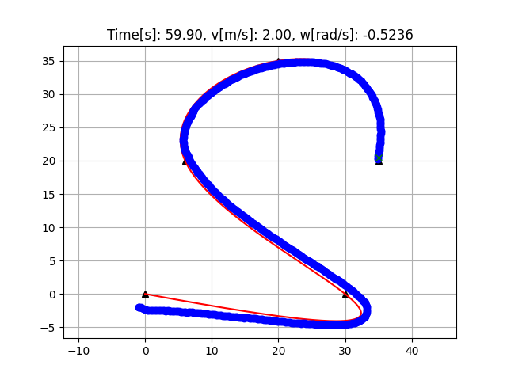
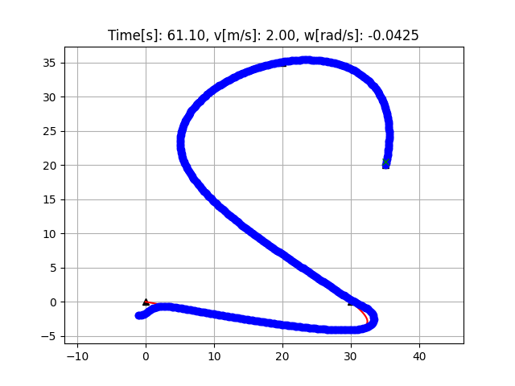
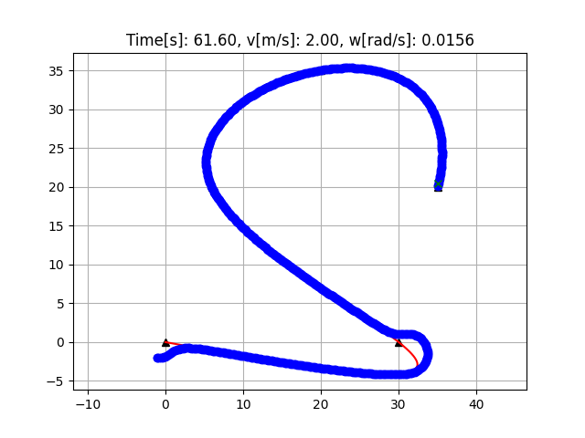

## Description
This repository implements some control methods such as (PID, LQR, MPC) of the differential drive robot (DRR), whose motion model is

$$
\dot{\xi} = f(\xi, u) \rightarrow
\begin{bmatrix}
\dot{x} \\ \dot{y} \\ \dot{\varphi}
\end{bmatrix} = 
\begin{bmatrix}
\cos\varphi & 0 \\
\sin\varphi & 0 \\
0 & 1
\end{bmatrix} 
\begin{bmatrix}
v \\ w
\end{bmatrix} = 
\begin{bmatrix}
v \cdot \cos\varphi \\
v \cdot \sin\varphi \\
\omega
\end{bmatrix}
$$

## Simulation Result

**PID**

This is the simulation result for PID control.




**LQR**

This is the simulation result for LQR control.



**MPC**

This is the simulation result for MPC control.




## Usage

How to use this repository? You just need to run the `xxx_controller.py` script and then you can see the trajectory though the figures.

Such as
```shell
cd ./LQR
python lqr_controller.py
```